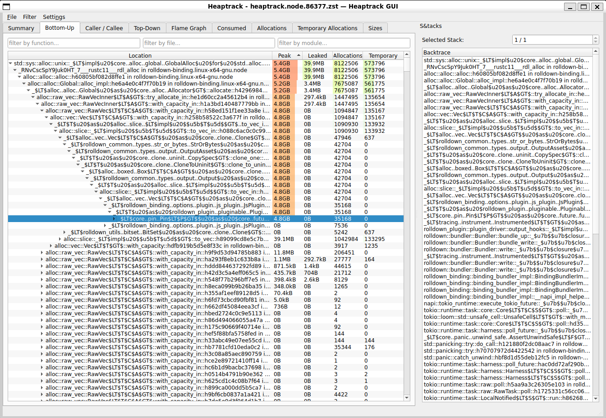

# 性能分析

## CPU 性能分析（samply）

### 准备工作

首先需要安装 [`samply`](https://github.com/mstange/samply)：

```bash
cargo binstall samply
```

::: warning

Samply 在 macOS 上的运行效果不佳，建议改用 Xcode Instruments。

:::

### 构建

要让构建产物包含 `samply` 所需的信息，请使用以下命令构建 Rolldown：

```shell
just build-rolldown-profile
```

### 执行性能分析

构建完成后，可以使用以下命令运行 Rolldown 并分析 CPU 使用情况：

```shell
samply record node ./path/to/script-rolldown-is-used.js
```

如果还想分析 JavaScript 部分，可以向 Node.js 传递 [所需标志](https://github.com/nodejs/node/pull/58010)：

```shell
samply record node --perf-prof --perf-basic-prof --perf-prof-unwinding-info --interpreted-frames-native-stack ./path/to/script-rolldown-is-used.js
```

## CPU 性能分析（Xcode Instruments）

### 配置

首先，请确保已经安装 Xcode。

### 构建

要让构建产物包含 Xcode Instruments 所需的信息，请使用以下命令构建 Rolldown：

```shell
just build-rolldown-profile
```

### 性能分析

构建完成后，可以使用以下命令运行 Rolldown 并分析 CPU 使用情况：

```shell
xctrace record --template "Time Profile" --output . --launch -- node ./path/to/script-rolldown-is-used.js
```

随后终端会输出结果文件路径。可以使用以下命令打开该文件：

```shell
open ./Launch_node_yyyy-mm-dd_hh.mm.ss_hash.trace
```

## 内存分析

可以使用 [`heaptrack`](https://github.com/KDE/heaptrack) 分析内存使用情况。

### 配置

首先需要安装 `heaptrack` 和 `heaptrack-gui`。如果使用 Ubuntu，可以运行：

```bash
sudo apt install heaptrack heaptrack-gui
```

::: warning

`heaptrack` 仅支持 Linux，但可以在 WSL 上正常运行。

:::

### 构建

要让构建产物包含 `heaptrack` 所需的信息，请使用以下命令构建 Rolldown：

```shell
just build-rolldown-memory-profile
```

### 性能分析

构建完成后，可以使用以下命令运行 Rolldown 并分析内存使用情况：

```shell
heaptrack node ./path/to/script-rolldown-is-used.js
```

::: tip 使用 asdf 或其他采用 shim 的版本管理器？

这种情况下，可能需要使用 Node.js 二进制文件的实际路径。例如，使用 asdf 时可以运行：

```shell
heaptrack $(asdf which node) ./path/to/script-rolldown-is-used.js
```

:::

脚本运行结束后，heaptrack GUI 会自动打开。


